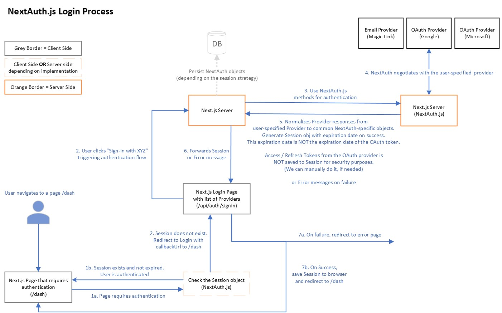
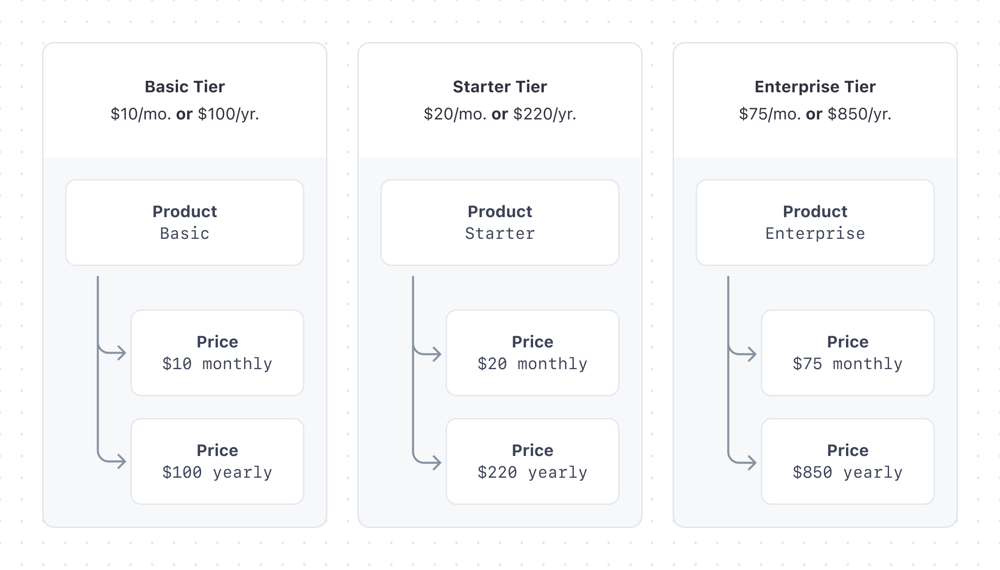
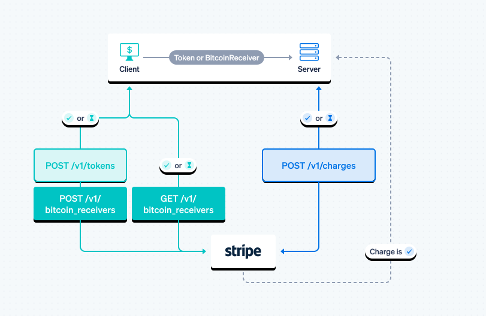

# Administrative web app to conect with MongoDB/ Realm BackEnd Server

## Refactoring

## Separating UI Components

- [x] Create Design System with UI Components  [Figma Design System](https://www.figma.com/file/j32l029L2OzdItUQIE3fbh/Admin-Manager-Colors?t=3arr77aHD6ZsSVj4-1)
- [x] Create atoms
- [] Create melocules
- [] Create organims

## Clean Architecture

- [x] MongoDB with Prisma [Advanced MongoDB Workshop](https://prismaio.notion.site/Advanced-MongoDB-Workshop-4a11353478b2410aa3768ca59c274507)
- [x] Model / [Prisma](https://prisma.io)
- [] Components
- [x] Adapters / [Prisma](https://prisma.io)
- [] External services

## Build basic

- [] Promoting page.

## Build basic layout

- [x] UI basic laoyut design. [Figma Design System](https://www.figma.com/file/j32l029L2OzdItUQIE3fbh/Admin-Manager-Colors?t=3arr77aHD6ZsSVj4-1)
- [x] UX basic laoyut design. [Figma Design System](https://www.figma.com/file/j32l029L2OzdItUQIE3fbh/Admin-Manager-Colors?t=3arr77aHD6ZsSVj4-1)

## Basic Configuration Home Page for Owners and Members

- [] Master of Companies and composition Page
- [] Membership assignment by company
- [] Definition of user roles by company

## Design function of the structure of the application

- [] General options menus
- [] Sub Menu of specific options
- [] Design of the structure of each specific module
- [] List Design (Infinite list layout)
- [] General screen layout

## Build business logic

- [x] Prisma schemas.   [Prisma](https://prisma.io)
- [x] MongoDB provider. [MongoDB](https://mongodb.com)
- [x] login.            [Next.js](https://nextjs.org) [NextAuth.js](https://next-auth.js.org)
- [] configure first time setup (in progress)
- [] configure stripe subscription
- [] companies.
- [] user's access permissions to companies.
- [] user's access permissions to stock & inventory modules

- [] stock inventory's adjust business logic
- [] stock inventory's transfers business logic (local & inter companies wharehouse)

- [] stock inventory's business logic
- [] stock prices business logic (multi companies)
- [] product's business logic (grouping by companies)
  - [] Provider's Orders.
  - [] Provider's Purchases.
  - [] Provider's Merchandise reception

## Build authenticated & first time setup (Wizard) pages

- [x] Login.
    
     <https://next-auth.js.org/>
- [x] basic wizard componenct
- [] configure first time setup wizard.
   
- [] configure stripe subscription wizard

## Build Home pages

- [] Promotional Landing Home page.

## Build Stock pages

- [] Inventory's adjust dashboard.
- [] Inventory's transfers dashboard.
- [] Inventory's dashboard.
- [] Product's dashboard.
  - [] Budget
  - [] Provider's Orders.
  - [] Provider's Purchases.
  - [] Provider's Merchandise reception

- [] Prices dashboard.

## Build Incoming pages

- [] Providers Orders
- [] Merchandise reception
- [] Merchandise purchase
  - [] Purchase expenses (Import expenses & others)
  - [] Close purchase

## Build Outcoming pages

- [] Customer orders confirmation
- [] Dispatch of merchandise
- [] Invoicing
